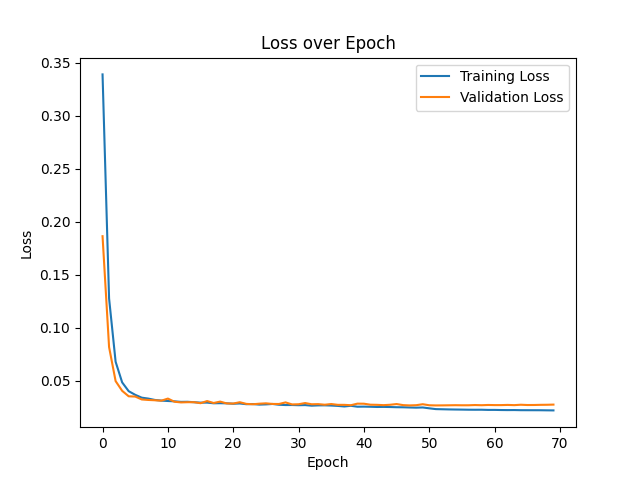
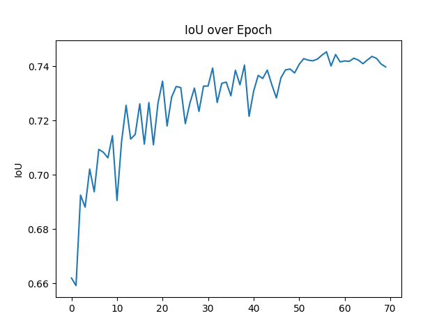
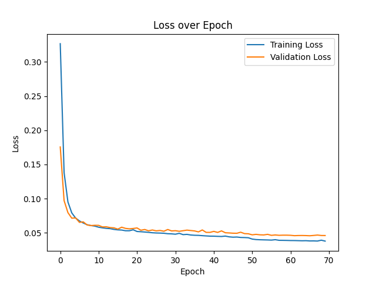
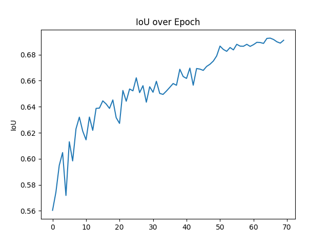
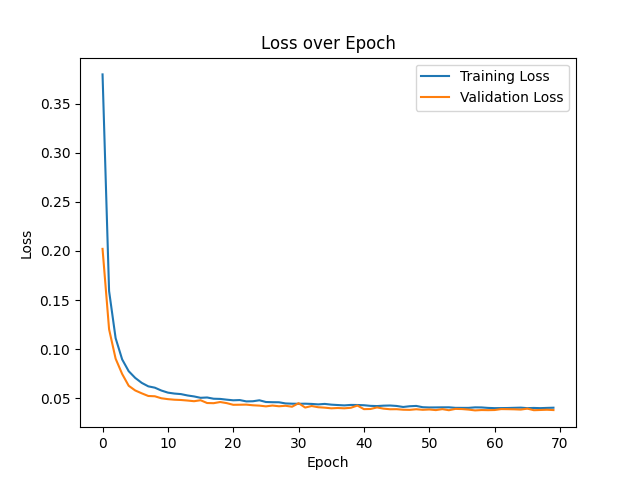
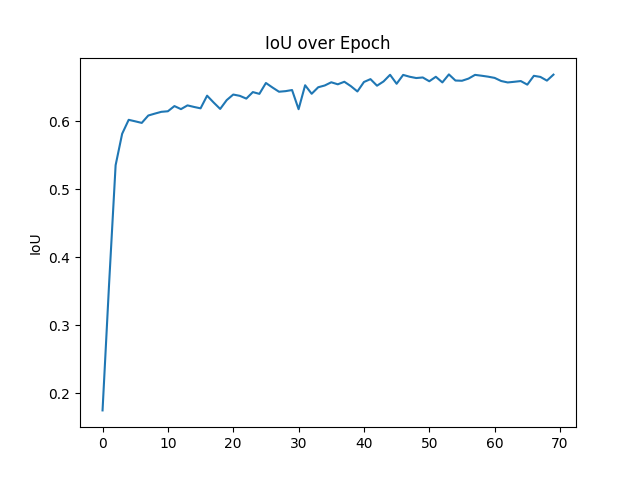
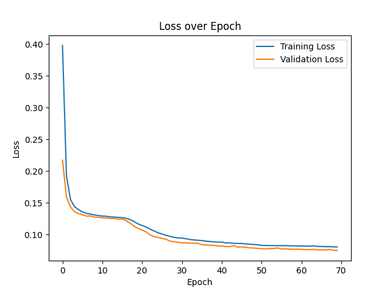
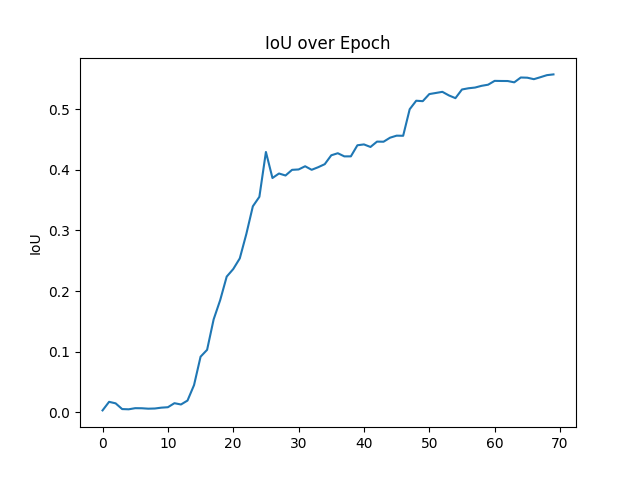

# HP-OSU-Capstone-2023-2024

The purpose of this repository is to train a semantic segmentation model to predict characteristic binary mask images. This repository uses pytorch framework. The models being used are UNet, ENet and DeepLabV3+

- [Requirements](#requirements)
- [Quick Start](#quick-start)
	- [how to train](#how-to-train)
	- [how to test](#how-to-test)
	- [how to inference](#how-to-inference)
- [Help](#help)
- [Config.py](#configpy)
- [Project structure](#project-structure)
---
## Requirements
```
matplotlib >= 3.8.2
Python >= 3.11.7
numpy >= 1.26.3
pillow >= 10.2.0
torch >= 2.2.0+cu118
torchaudio >= 2.2.0+cu118
torchvision >= 0.17.0+cu118
tqdm >= 4.66.1
```
---
## Quick start

#### How to train
Example:
`python main.py --model=unet --mode=train --batch=5 --epoch=70 --dataset=simplex --input_folder=PATH_TO_INPUT_FOLDER --label_folder=PATH_TO_LABEL_FOLDER  --save_folder=PATH_TO_CHECKOOINT_FILES`

It shows how to run the script to start training a UNet model, witch batch size of 5, 70 epochs, and simplex dataset
#### How to test
Example:
`python main.py --model=unet --mode=test --batch=5 --dataset=simplex --input_folder=PATH_TO_INPUT_FOLDER --label_folder=PATH_TO_LABEL_FOLDER  --save_folder=PATH_TO_CHECKOOINT_FILES`

It shows how to run the script to start testing a UNet model, with batch size of 5, and simplex dataset
#### How to inference
Example:
`python main.py --model=unet --mode=inference --batch=5 --dataset=simplex --input_folder=PATH_TO_INPUT_FOLDER --OUTPUT_folder=PATH_TO_OUTPUT_FOLDER  --save_folder=PATH_TO_CHECKOOINT_FILES`

It shows how to run the script to start generate outputs given inputs, with batch size of 5, assume data is simplex type, output to the folder 'PATH_TO_OUTPUT_FOLDER'

---
## Help
This commands list all available arguments for running main.py
`python main.py --help`

The list of available arguments:

Folder related:
```
--input_folder: path to the folder contains input data, etc., pdf grayscale images for each channel
--label_folder: path to the folder contains label data, etc., binary images	for each characteristics	
--output_folder: path to the folder that the model is going to output binary imagess
--save_folder: path to the folder that will store model weight files
```

Model setting:
```
--model: The model architecture to use, etc.: unet, enet.
--dataset: The type of dataset, etc.: simplex, duplex
--mode: The mode the script is going to run, etc.:train, test, inference.
```
Hyper-parameter:
```
--epoch: Number of epoch the model is going to run, only use in train mode
--lr: The learning rate, only use in train mode
--batch: The batch size model is going to take
```
Learning Rate decay:
```
--lr_decay: Learning rate decay
--lr_epoch Learning rate decay epoch, every 'lr_epoch' epoch the learning rate going to decay 
```

---
## Config.py
Input configutions:
```
img_extension: The file extension associated to input channel images, by default is '.png'
features: A list of input channel name
```

Output configurations:
```
label_extension: The file extension associated to label images, by default is '.bmp'
labels: A list of simplex characteristic names in results.json intermediate results
duplex_labels: A list of duplex characteristic names in results.json intermediate results 
detect_labels: A list of simplex characteristic names in results.json algorithm results
detect_duplex_labels: A list of duplex characteristic names in results.json algorithm results
```

Dataset split ratio:
```
train_val_ratio: The split ratio for training and validation data, default is 0.9 and 0.1 
train_test_ratio: The split ration for training(including validation) and testing data, default is 0.7 and 0.3
```

Dataloader configution:
```
pin_memory: Allocate samples in a page-locked memory 
```

Image transformation:
```
input_height: The resize height dimension for input channel images 
input_width: The resize width dimension for input channel images
output_height: The resize height dimension for label masked images
output_width: The resize width dimension for label masked images
```

Threshold for binary conversion:
```
threshold: The threshold value to convert from predicted grayscale image to binary image
```

Dataloader filenames:
```
train_dataloader_name: The filename for train dataloader
val_dataloader_name: The filename for validation dataloader
test_dataloader_name: The filename for test dataloader
```

---
## Project structure

- checkpoints
- config
- data
- dataloader
- model
- pdf_webcrawler
- plots
- train
- utils

**checkpoints** :This folder contains the files that store model weights

**config**: This folder contains the configuration related to input channels and output characteristics

**data**: This is where the data should be place under

**dataloader**: This folder contains a script to process and convert data to dataloader , and save them as .pt files

**model**: This folder contains the model architectures

**pdf_webcrawler**: This folder contains scripts that use scrappy to scrap pdf files from websites

**plots**: This folder contains plots, such as training loss over epoch.

**train**: This folder contains training script, testing script

**utils**: This folder contains utilities scripts, such as load json files, check for valid data, etc.

## Results

Model  | Training Loss												  | IoU												 |
-------|-------------------------------------------------------------|--------------------------------------------------|
UNet Simplex| | |
UNet Duplex|   |   |
ENet Simplex| | |
ENet Duplex|   |   |

---

## Reference
[UNet paper](https://arxiv.org/pdf/1505.04597.pdf)

[UNet pytorch Implementation repo](https://github.com/milesial/Pytorch-UNet)

[ENet paper](https://arxiv.org/pdf/1606.02147.pdf)

[ENet pytorch implementation repo](https://github.com/davidtvs/PyTorch-ENet)


## Future Improvements
